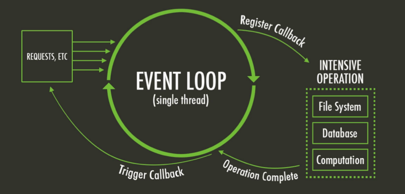
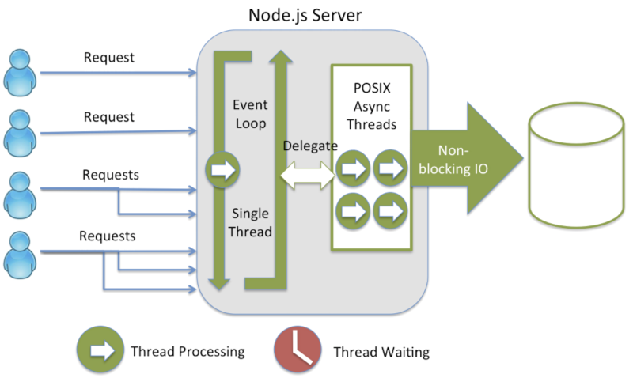

# ASYNC EN NODE: TIPS AND TRICKS

[Async en node](https://blog.bitsrc.io/understanding-javascript-async-and-await-with-examples-a010b03926ea)

- la asincronia en js se invento para actuar de forma reactiva a eventos del navegador

- la asincronia es una gran idea para las operaciones que tarden mucho, pe: I/O, cifrados, ...
asi no bloqueas al resto del programa mientras estas operaciones tardan en acabar.

- En node SÓLO hay un hilo de ejecución, que funciona como un automata a pila de Turing (el loopback) y una cola de tareas en espera:

[Charla sobre el lookback de node](https://www.youtube.com/watch?v=6MXRNXXgP_0)



- todas las funciones en node son asincronas, así que somos programadores de apis *async*
  - callbacks, callbacks everywhere: [node api](https://nodejs.org/docs/latest/api/fs.html#fs_fs_read_fd_buffer_offset_length_position_callback)
  - EventEmitter (patrón pub/sub), con callbacks: [node api](https://nodejs.org/docs/latest/api/events.html#events_class_eventemitter)
  - Promesas (¿te fias de las promesas de otros?)
  - Funciones generadoras
  - Async/Await: *syntax sugar* de Promesas

- la asincronía es buena para la gestión de la concurrencia pero es mas lento en operaciones de cálculo.



- Alguano conceptos:
  - **concurrente** vs **secuencial** => ejecución a la vez o uno detras de otro
  - **sincrono** vs **asincrono** => bloqueante frente a no bloqueante
  - **paralelo** vs **concurrente** => formas de llevar a cabo la concurrencia

> Concurrency and parallelism are two related but distinct concepts.
Concurrency means, essentially, that task A and task B both need to happen independently of each other, and A starts running, and then B starts before A is finished.
There are various different ways of accomplishing concurrency. One of them is parallelism--having multiple CPUs working on the different tasks at the same time. But that's not the only way. Another is by task switching, which works like this: Task A works up to a certain point, then the CPU working on it stops and switches over to task B, works on it for a while, and then switches back to task A. If the time slices are small enough, it may appear to the user that both things are being run in parallel, even though they're actually being processed in serial by a multitasking CPU.


## Primero las promesas:

```Promise<any>``` abstrae de una computación que no se sabe cuando concluirá:

```javascript
Promise.resolve('')
Promise.reject(new Error())
Promise.all([])
```

```javascript
const iPromise = new Promise((resolve, reject) => {})
iPromise.resolve()
	.then()
	.then()
	.then() // es un pipeline => functional
	.catch(err)
```

[Try me](http://bevacqua.github.io/promisees/#)

## Async/Await

- **async** prefijo de una funcion:
	hace que devuelva una promesa de la function que adjetiva

- **await**
	- espera una promesa y saca el resultado de la promesa resulta para que lo asignes a una variable (bueno es mentira, espera un objeto con un metodo then, un *theable*)
	- o lanza un Error con el valor de la promesa rechazada o el propio Error de la promesa rechazada

Convierte en aparentemente secuencial un programa asincrono, pero NO PARA EL HILO DE EJECUCIÓN DE NODE. Lo que hace es ejecutar la parte posterior al await cuando la computación bloqueante ha concluido, dejando que el hilo de node siga ejecutanto otras instrucciones dentro del loopback.


### 2. **async** solo: sin await, también mola porque revela la intención del método, devolver una promesa.

- promisificar: es igual que devolver ```Promise.resolve()``` o ```Promise.resolve('ok')``` o ```Promise.reject(new Error('something bad happen!'))```
y ademas te llevas puesto q en la declaracion informa que devuelve una promesa

```javascript
async function promisifyed_ () {
	return 'ok'
} // === Promise.resolve('ok')

async function promisifyed__ () {
	throw new Error('something bad happen!')
} // === Promise.reject(new Error('something bad happen!'))
```


### 3. **await**

- thenable [ir al código](3_await/3.1_thenable.js)
- throw [ir al código](3_await/3.1_throwable.js)
- compatibilidad [ir al código](3_await/3.1_compatibility.js)


### 4. **async/await**

- operaciones secuenciales [ir al código](4_async_await/4_async_await.js)

- ¿es = o != en rendimiento, fujo de exe, ... todo await o return la última promesa?
	- parece que el rendimiento de devolver la última promesa es mejor
	- mezclar no es bueno, usa sólo un tipo de codificación
	- el return de un promesa en una fn async ya no permite el catch del error en la async, será responsabilidad del cliente


### 5. **async-await**: concurrencia como Promise.all

- operaciones concurrentes [ref](https://medium.com/@bluepnume/even-with-async-await-you-probably-still-need-promises-9b259854c161)


### 6. **async/await en filter, map, reduce and forEach**

- todos estós métodos de Array son síncronos, por lo que para usar funciones async como argumentos de sus callbacks hay que tener en cuenta que implica:

* **filter**: no se puede usar, porque el resultado del callback es una Promise, que como es un object el resultado del filter simpre es true ya que da truthy al filter y seleciona todos los elementos del array

* **map**: sirve para lanzar operaciones asincronas de forma concurrentes de los que luego recuperas sus valores con un Promise.all.

* **reduce**: puedes secuencializar la ejecución de operaciones asincronas y e ir acumulando los valores necesarios para devolver una promesa con el valor resultado.

* **forEach**: No sirve para secuencializar ni paralelizar, la ejecución continua perdiendo el control concurrente pero pierdes del control de cuando acaba o como acaba.


### 7. Utilidades

- promisify se puede usar siempre y cuando las funciones de callback reciban un error en el primer parametro de la función [ir al código](7_utils/7.1_utils.promisify.js)

```javascript
asyncFunc (err: Error, ...param: [any]): any
util.promisify(asyncFunc) => Promise<any>
```

- scripts asincronos: todo async/await sin api de Promise [ir al código](7_utils/7.2_scripts.js)

- Ya que sabeis promisificar y de concurrencia, ya sea con esto o con async: NO USEIS LOS MÉTODOS SYNC, QUE BLOQUEAN EL HILO DE NODE  [ir al código](7_utils/7.3_tips.js)
  - Opciones:
 	- promisificar
 	- fs-extra module
 	- https://nodejs.org/dist/latest/docs/api/fs.html#fs_fs_promises_api


### 8. Beyond: [ir al código](8_beyond/8_beyond.js)

- No todos son Promise y async/await tambien hay EventEmitter (Pub/Sub) y callbacks: [ref](https://medium.com/@ulisesGascon/pensar-as%C3%ADncronamente-en-un-mundo-s%C3%ADncrono-8e25cfcafd83)
